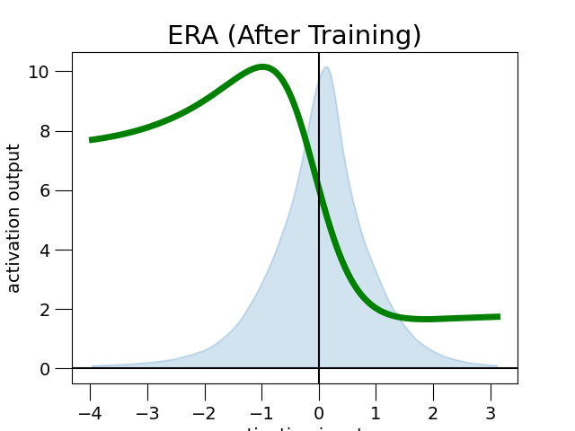

# ERA: Enhanced Rational Activations

## 1. Dependencies
This is the repository of the paper [ERA: Enhanced Rational Activations](https://www.ecva.net/papers/eccv_2022/papers_ECCV/papers/136800705.pdf).
The code uses ***PyTorch*** 2.0.1. (Code for TensorFlow can be found [here](https://github.com/martrim/ERA).) For other pip recommended pip packages, please check the requirements.txt file. To run on GPUs, we use CUDA 11.7.

## 2. Enhanced Rational Activations

Enhanced Rational Activations (ERAs) are a new type of activation functions. They are rational functions with a **safe polynomial denominator** based on quadratic factorisation. ERAs of degree ${\large 2n}$ take the form

$${\huge \sigma(x) = ax + b + \sum_{i=1}^n \frac{c_ix + d_i}{(x-e_i)^2 + f_i^2},}$$
where ${\large a, b, c_i, d_i, e_i, f_i \in \mathbb{R}}$ are real parameters for all ${\large i}$. In practice, simple functions of degree 2, having a single fractional term, work often best.

The parameters of ${\large \sigma}$ are optimized during the training of the network. The parameters can be initialized so that ${\large \sigma}$ resembles a standard activation function like ReLU, Leaky ReLU, Swish or GELU. In contrast to prior work, they are also often stable when initialized randomly. We note that Swish initialization works often best in practice.

ERAs work best when the pre-activation values are normalized by standard techniques like instance normalization for CNNs and layer normalization for MLPs. Normalization makes the pre-activation distribution evolve slowly during training, which benefits the learning process.

## 3. Plots of Learned ERAs
Plot of Swish-initialised ERA with denominator of degree 4:


## 4. Contact
Feel free to open an issue if you have any questions. The corresponding author is Martin Trimmel from Lund University.

## 5. Cite Us in Your Paper
```
@inproceedings{ERA2022,
  title={ERA: Enhanced Rational Activations},
  author={Trimmel, Martin and Zanfir, Mihai and Hartley, Richard and Sminchisescu, Cristian},
  booktitle={European Conference on Computer Vision},
  year={2022}
}
```
